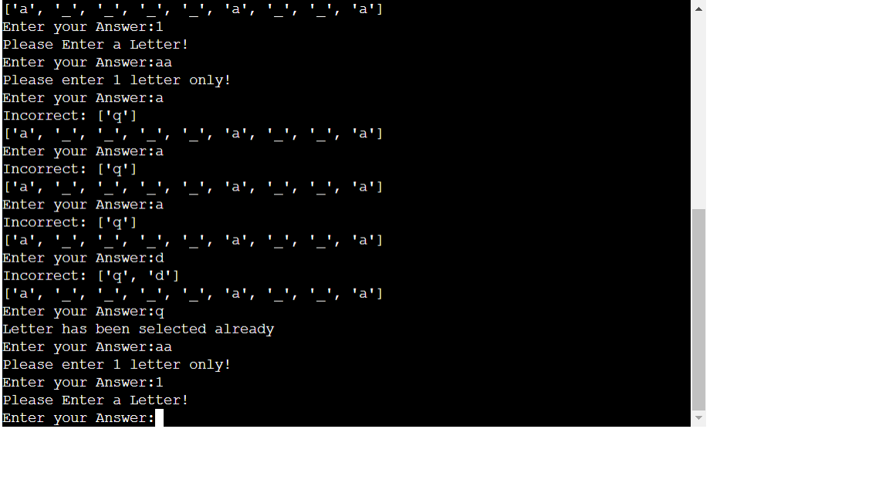
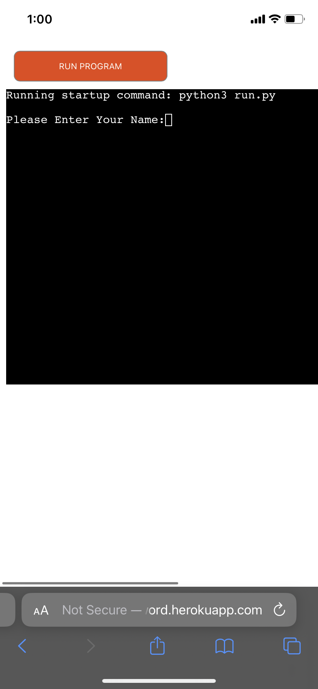

Guess the Word is a Python Based Game which is launch on the Heroku

User or player will choose from the category that they would like their word to come from and will have 5 chances to guess the word from their chosen category.

<a href="https://guess-the-word.herokuapp.com/"> Live Game Link</a>

<h1>How to Play</h1>
Guess the word took the inspiration from the hangman game which is guessing the word before the man is hanged or ran out of lives

Players will be asked first of their name

Then they will be welcomed and ask for the category they wish their word to come from

Player will guess and enter 1 letter at a time to slowly reveal the answer

The player will have 5 lives or 5 incorrect guesses, after which player will lose the game

If player has successfully guessed the word, player wins the game!

Choose your category carefully, and goodluck!

<h1>Features<h1>
<ul>
<li>Random Word Chosen from the players choice of category</li>

    
    - Player will be given a random word based from the category he/she has chosen

<li>Input Validation</li>
 - game will only accept inputs that are from the category  
 - game will not accept more than 1 letter input 
 - game will not accept letter input if game requires player to enter a numeric value and vice versa 

</ul>

<h2>Future Features</h2>
<ul>
<li>More categories</li>
<li>More Words from each category</li>
<li>A much cleaner UI</li>
</ul>

<h1>Data Model</h1>
I had decided to make some functions for the game to seperate the work and to do DRY coding. 

The first function is category_selection which will initiate on asking the player for his/her category and after player has chosen a correct category, the next function will be called on which is the_game and it consist of loops and if statements which comprises of the game itself. 

And the third function is new_game which basically asks player if he/she wants to do another round of the game after he/she finishes the game.

<h1>Testing</h1>
I had manually tested the game and the tests i had done were:
<ul>
<li>tested code on Pep8 linter and confirmed there was no errors</li> 

<li>Tested on my mobile device and has ran smoothly</li>

<li>Manually troubleshooting the code and giving it incorrect inputs to check for problems on the code</li>
</ul>

<h1>BUGS</h1>
<ul>
<li>Game tends to go back to category_selection function if I use else on the new_game function, so i used if instead of else to solve the problem</li>
<li>the chosen_word parameter was not being detected on the_game function after I had chosen my category, I was able to solve it by moving calling of the_game function from the bottom of the except to inside the try</li>

<h1>Remaining Bugs</h1>
No bugs have been noted since then.

<h1>Validation</h1>
- no validation error from Pep8 Linter

<h1>Deployment</h1>
<ol>
<li>Created on Heroku a new app</li>
<li>On the settings tab, Set the buildpacks to python and nodejs on that order</li>
<li>On the deploy tab, I select Github as my deployment method, then connect my repository</li>
<li>Clicked on Manual deploy</li>
<li>And here is the <a href="https://guess-the-word.herokuapp.com/">link(https://guess-the-word.herokuapp.com/)</a> for the game</li>
</ol>

 
 
<h1>Credits</h1>
<ul>
<li>Code Institute for the Python essentials course</li>
<li>Programming with Mosh (https://www.youtube.com/@programmingwithmosh) for some python tutorial</li>
<li>Bro Code (https://www.youtube.com/@BroCodez) for some python course/tutorial</li>
<li>https://www.geeksforgeeks.org/ for some helpful tips on solving some of the bugs</li>
<li>Stack overflow forum for some tips to solve some of my problems (https://stackoverflow.com/questions/)</li>
<li>(https://github.com/python/cpython/blob/3.11/Lib/os.py) for the os module that I included</li>
<li>(https://github.com/python/cpython/blob/3.11/Lib/random.py) for the random module that I included</li>
</ul>